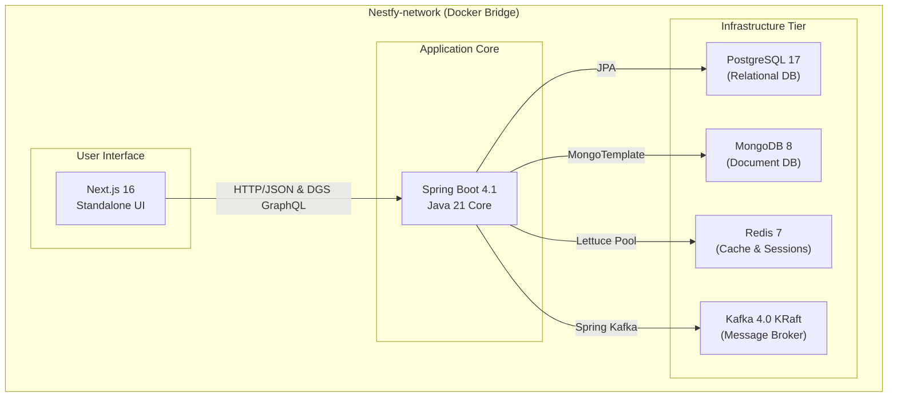

# ╔══════════════════════════════════════════════════════════════════════╗
# ║                                Nestfy                                ║
# ║          Design-Driven Engineering & Clean Architecture              ║
# ╚══════════════════════════════════════════════════════════════════════╝

Nestfy is a high-performance, containerized micro-ecosystem built on a **3-tier decoupled architecture**. It combines **Spring Boot 4.1 (Java 21)** following Hexagonal/Clean Architecture principles on the backend and **Next.js 16 (Node 22)** on the frontend. 

---

## 🏗️ System Architecture

The project is structured into three logically isolated compose tiers communicating over a shared bridge network (`Nestfy-network`):



---

## 🐳 Docker Deployment & Orchestration

The project provides three decoupled Compose files to run each tier independently or as a unified stack.

### Decoupled Compose Files
* [docker-compose.infra.yml](file:///c:/Users/Matheus/Documents/Leon/mobile/projeto-6/Nestfy-4/docker-compose.infra.yml): Configures PostgreSQL 17, MongoDB 8, Redis 7 (with appendonly/fsync & LRU policy), and Apache Kafka 4.0 (KRaft mode).
* [docker-compose.backend.yml](file:///c:/Users/Matheus/Documents/Leon/mobile/projeto-6/Nestfy-4/docker-compose.backend.yml): Configures the Spring Boot backend with connection check guarantees.
* [docker-compose.frontend.yml](file:///c:/Users/Matheus/Documents/Leon/mobile/projeto-6/Nestfy-4/docker-compose.frontend.yml): Runs the Next.js standalone container.

### Makefile Commands
For ease of management, a unified [Makefile](file:///c:/Users/Matheus/Documents/Leon/mobile/projeto-6/Nestfy-4/Makefile) is provided in the project root:

```bash
# 1. Create the shared network
make network

# 2. Boot up only database & messaging infrastructure
make infra

# 3. Boot up infrastructure and Backend service
make backend

# 4. Boot up the entire stack (Infra + Backend + Frontend Next.js)
make up

# 5. Stop all running containers
make down

# 6. Completely wipe containers, network, and named data volumes
make clean

# 7. Check container statuses and logs
make status
make logs-backend
make logs-frontend
```

---

## 📦 Ports & Mapped Services

| Service | Protocol | Internal Port | External Port | Data Persistence |
| :--- | :--- | :--- | :--- | :--- |
| **Next.js Frontend** | HTTP | `3000` | `3001` | Transient |
| **Spring Boot Backend** | HTTP | `8080` | `8081` | Transient / Logs |
| **PostgreSQL 17** | TCP | `5432` | `5433` | `nestfy_postgres_data` volume |
| **MongoDB 8** | TCP | `27017` | `27017` | `nestfy_mongo_data` volume |
| **Redis 7** | TCP | `6379` | `6380` | `nestfy_redis_data` volume |
| **Kafka (Broker)** | TCP | `9092` | `9094` (Inside network) / `29092` (Host localhost) | `nestfy_kafka_data` volume |

---

## 🚀 CI/CD Pipeline (GitHub Actions)

The Continuous Integration & Delivery pipeline is defined in [.github/workflows/cd.yml](file:///c:/Users/Matheus/Documents/Leon/mobile/projeto-6/Nestfy-4/.github/workflows/cd.yml):

### Pipeline Stages
1. **Backend Integration (CI)**: Runs `mvn clean test` on Java 21 distribution to validate core logic, compile classes, and run unit tests.
2. **Frontend Integration (CI)**: Runs linter audits and checks Next.js bundle building (`npm run build`).
3. **Docker Build & Push (CD)**:
   - Triggered on direct merges to target branches (`main` or `master`).
   - Uses multi-stage caching (`cache-from/to: type=gha`) via Docker Buildx.
   - Pushes highly optimized images to **GitHub Container Registry (GHCR)**:
     - **Backend**: Alpine runtime, layers separated for cache-efficiency (~200MB).
     - **Frontend**: Standalone output mode enabled in [next.config.ts](file:///c:/Users/Matheus/Documents/Leon/mobile/projeto-6/Nestfy-4/frontend/next.config.ts), leaving behind all unnecessary dependencies (~120MB).
4. **Automated SSH Deployment (CD)**:
   - Connects to your target production VPS via SSH.
   - Executes `docker compose pull` to grab the fresh registry images.
   - Performs a rolling deployment using `docker compose up -d`.

---

## 🛣️ Routes & API Contracts

### Backend Observability Endpoints (Actuator)
Spring Boot exposes system health and telemetry under the `/actuator` prefix:

* **`/actuator/health`**: Returns detailed health states for databases (PostgreSQL, MongoDB, Redis) and disk space. Used as the Docker orchestration health check target.
* **`/actuator/prometheus`**: Exposes system and JVM metrics formatted for Prometheus scraping.

### Developing New Endpoints (Hexagonal Architecture)
The backend is structured into domain models and ports. To add new endpoints, implement incoming adapters (controllers/resolvers):

#### 1. REST Controllers
Create REST endpoints by adding controllers under `infrastructure/adapters/in/web`:
```java
@RestController
@RequestMapping("/api/v1/products")
public class ProductController {
    // Inject UseCases/Ports
}
```

#### 2. GraphQL Schema & Codegen (DGS Framework)
The Netflix DGS Codegen plugin is pre-configured. Write your schema files under [graphql-client](file:///c:/Users/Matheus/Documents/Leon/mobile/projeto-6/Nestfy-4/backend/src/main/resources/graphql-client):
1. Place a `.graphqls` file in `backend/src/main/resources/graphql-client/schema.graphqls`.
2. Compile using `mvn compile`.
3. Java representation models will automatically generate under `com.example.backend.codegen`.
